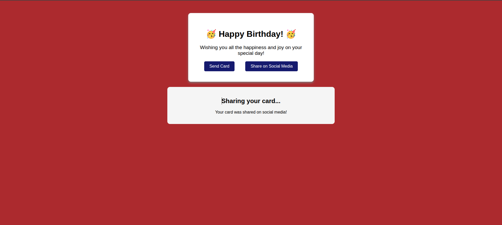

# 🌐 Greeting Card - 

This project is an interactive greeting card developed as part of the **freeCodeCamp** Web Design certification. The goal is to create a visually appealing card using HTML and CSS, leveraging modern design principles and interactivity.

## 🛠 Technologies
* **HTML5:** Semantic structure including `section` elements for interactive content.
* **CSS3 Features:**
    * **Pseudo-elements:** Used `::before` and `::after` to inject decorative emojis via CSS.
    * **Interactive Pseudo-classes:** Implemented `:hover`, `:active`, `:focus`, and `:visited` for button states.
    * **Targeting Logic:** Leveraged the `:target` pseudo-class to create a "single-page" feel by showing/hiding sections without JavaScript.
    * **Advanced Transforms:** Applied `scale()` and `skewX()` for dynamic user feedback.

## 🚀 Features
* **Dynamic Content Display:** Users can "send" or "share" the card, revealing confirmation sections via CSS `:target` logic.
* **Interactive Hover Effects:** The card scales and changes background color (`khaki`) smoothly using CSS transitions.
* **Smart Navigation:** The buttons feature distinct styles for accessibility (focus outlines) and interaction history (visited states).
* **Decorative Styling:** Automatic emoji insertion for headers using CSS generated content.

## 🧠 The Process
The main challenge was creating an interactive experience using only CSS. I focused on the relationship between anchor links and `section` IDs to trigger the `:target` state. I also practiced combining multiple transitions (transform and background-color) to ensure the UI feels fluid rather than abrupt.

## 💻 Running the Project
1. Clone the repository
2. Open `index.html` in your browser

## 🖼 Preview

### Quick Links
[Live Demo](https://rkaus.dev/password-generator) *(Coming Soon)*
